<p align="center">
  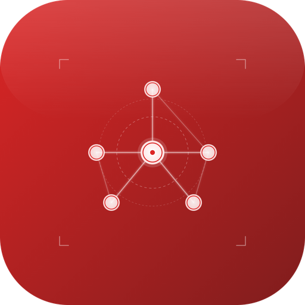
</p>

<h1 align="center">Red Grid Link</h1>

[](https://github.com/RedGridTactical/RedGridMGRS)
[]()
[](LICENSE)
[](PRIVACY.md)
[]()
[]()
[]()
[]()
[]()
[]()
[]()
[](https://buymeacoffee.com/redgridtac0)

> ## ⚠️ Red Grid Link has merged into Red Grid MGRS
>
> **v1.7.0 was the final release.** Red Grid Link is no longer distributed or sold. Team awareness now ships inside **[Red Grid MGRS](https://github.com/RedGridTactical/RedGridMGRS)** as an encrypted layer over Meshtastic, on the same offline map you already navigate with. One app, one purchase.
>
> - **Already have it installed?** It keeps working. v1.7.0 unlocks every feature for everyone at no charge.
> - **Paying for it?** You are not. Every subscription and the lifetime unlock have been removed from sale on both the App Store and Google Play. Nothing renews.
> - **Want the team features?** They are in [Red Grid MGRS](https://github.com/RedGridTactical/RedGridMGRS) ([App Store](https://apps.apple.com/app/id6759629554) · [Google Play](https://play.google.com/store/apps/details?id=com.redgrid.redgridtactical)).
>
> This repository stays public and open source as an archive of the work. It is **feature-frozen**: no new releases are planned, and issues and pull requests are not being actively worked. All ongoing development happens in [RedGridMGRS](https://github.com/RedGridTactical/RedGridMGRS).

---

**Offline MGRS maps and nearby team coordination for small teams (2-8 people). No cell service needed for active Field Link sessions.**

Built on the MGRS engine from [Red Grid MGRS](https://github.com/RedGridTactical/RedGridMGRS). Field Link adds zero-config proximity sync over Bluetooth, with Apple Multipeer Connectivity (iOS) and Google Play Services Nearby Connections (Android) running alongside as a parallel higher-bandwidth transport -- your team appears on the map the moment they're in range.

> **Looking for the maintained app?** [Red Grid MGRS](https://github.com/RedGridTactical/RedGridMGRS) is a DAGR-class MGRS navigator with 12 tactical tools, 6 radio-ready report templates, and the encrypted team awareness that used to live here. Part of the [Red Grid Tactical](https://redgridtactical.com) ecosystem.

---

## Screenshots

| Team Map | MGRS Grid | Field Link | Tools | Themes |
|:---:|:---:|:---:|:---:|:---:|
| 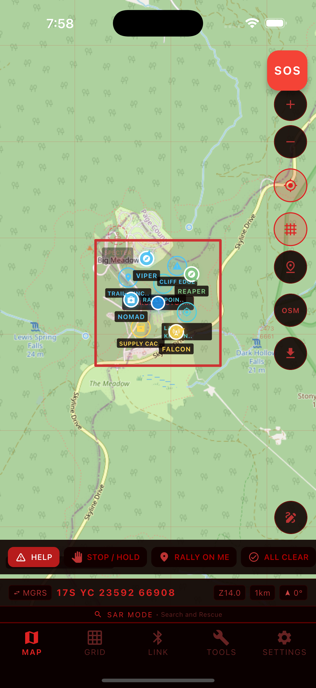 | 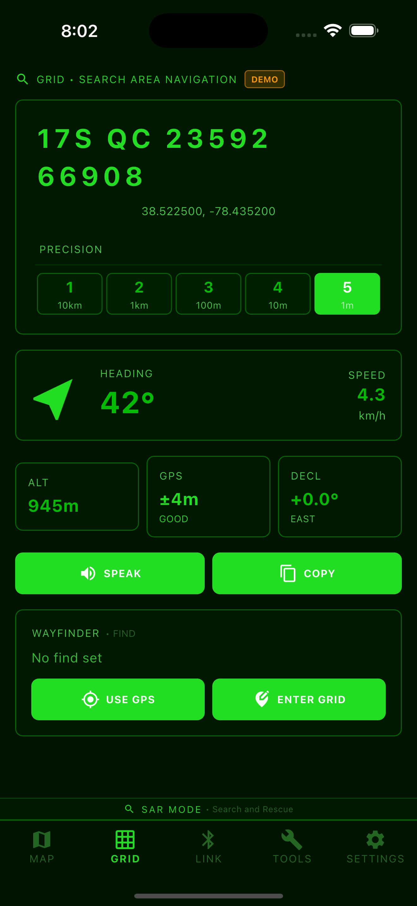 | 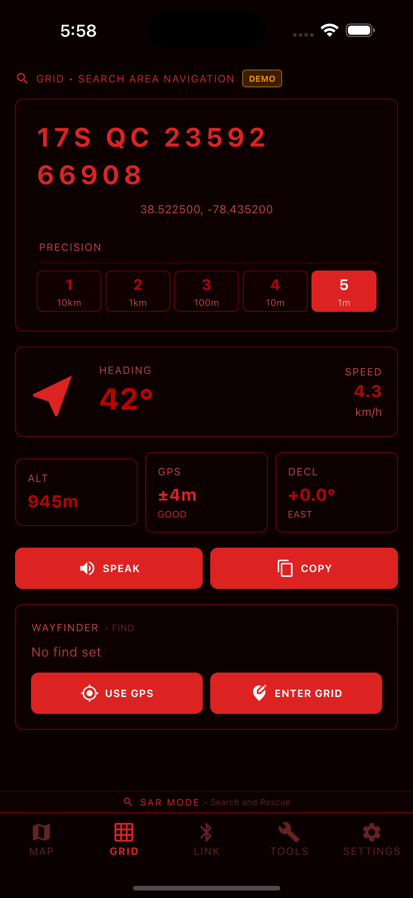 | 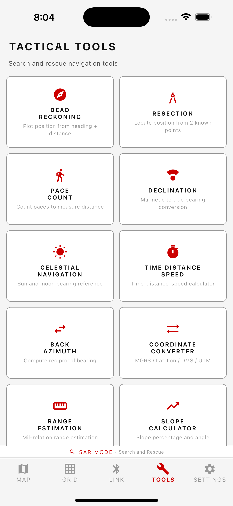 | 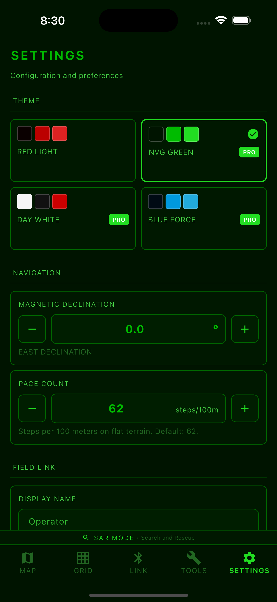 |

| Peer Detail | Dead Reckoning | Celestial Nav | Search Area | Team Roster |
|:---:|:---:|:---:|:---:|:---:|
| 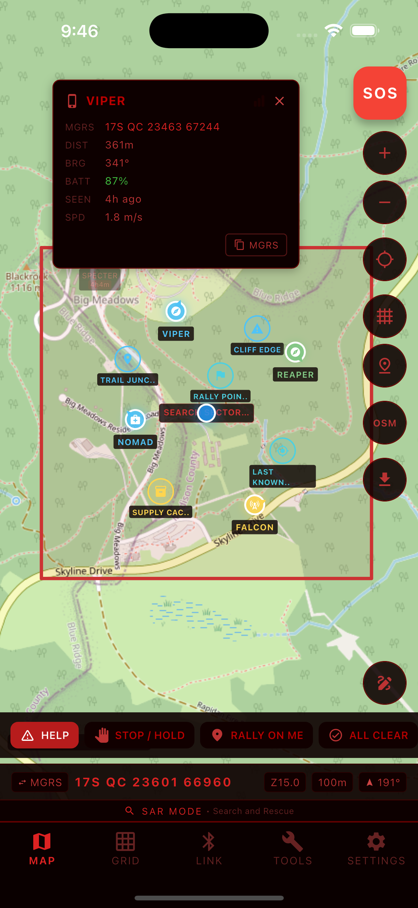 | 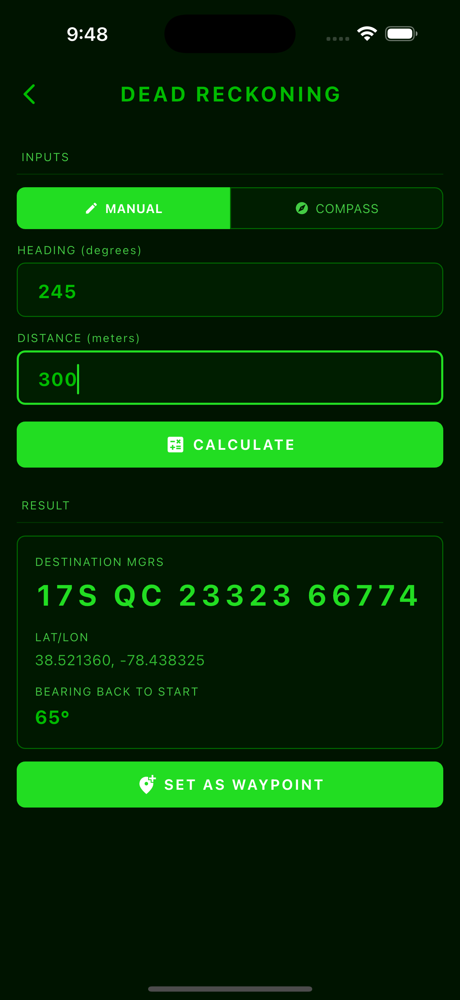 | 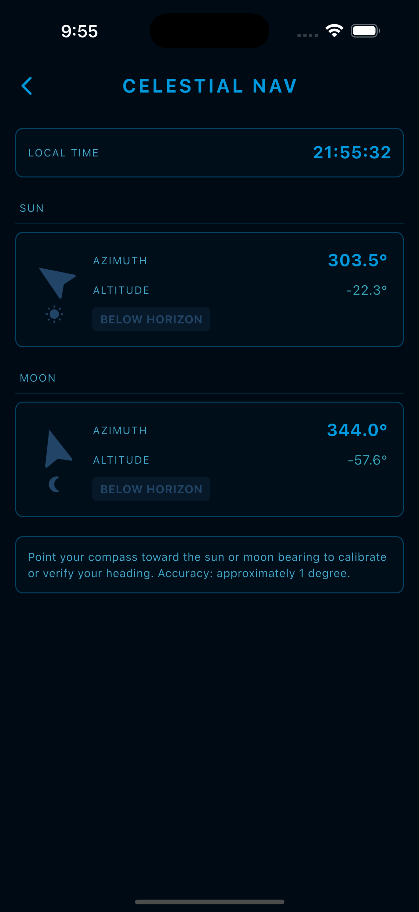 | 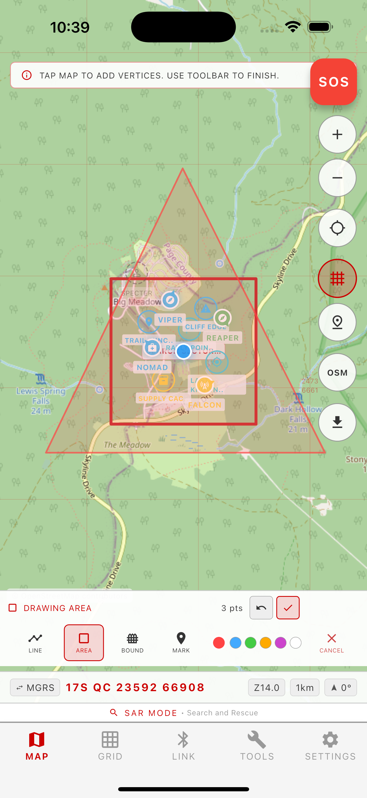 | 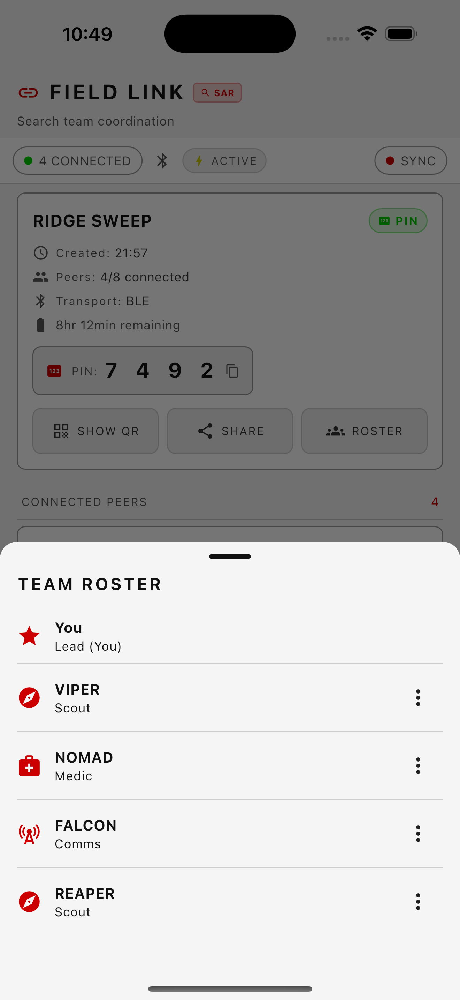 |

---

## Features

### MGRS-Native Navigation
Live Military Grid Reference System coordinates with 1-meter precision. GPS Kalman filter for smooth, accurate position tracking. MGRS grid overlay on offline maps from GZD down to 100m resolution. Bearing, distance, dead reckoning, resection, pace count (with accelerometer step detection), declination, and coordinate conversion tools. NATO phonetic voice readout for hands-free grid calls.

### Field Link -- Team Sync Without Infrastructure
Zero-config proximity sync over BLE on all platforms, with Apple Multipeer Connectivity (AWDL) on iOS and Google Play Services Nearby Connections on Android as parallel higher-bandwidth peer transports. Devices within range automatically discover each other and share position, marker, and annotation data. No cell service, pairing codes, or Red Grid servers required for active sessions.

- 2-8 devices per session
- AES-256-GCM encryption with ECDH P-256 ephemeral keys for PIN and QR sessions; Open sessions are unencrypted by design (training / demo use)
- Tiered session security: Open (auto-join, no encryption), PIN (4-digit, encrypted), QR code (host-generated session secret, encrypted)
- Delta payloads under 200 bytes per position update
- Ghost markers with time-decay visualization when teammates disconnect
- Velocity vectors project last-known movement direction
- Expedition Mode: <3% battery/hr (BLE-only, 30s updates)
- Ultra Expedition Mode: <2% battery/hr (BLE-only, 60s updates)
- Auto-reconnect with exponential backoff on disconnect

### Offline Maps
Download map packs from OpenStreetMap or OpenTopoMap to MBTiles for offline operation, with MGRS grid lines rendered as a dynamic overlay. Region downloads are throttled to respect public-tile-server usage policies; for sustained heavy offline usage we recommend a licensed provider. (Native USGS / Mapbox / MapTiler integrations are on the roadmap.)

### 4 Operational Modes
One engine, four presentation layers. Terminology, icons, and quick actions adapt to your mission:
- **Search & Rescue** -- sector assignments, clue markers, search patterns
- **Backcountry** -- camp, waypoint, and trail navigation
- **Hunting** -- stand locations, game sightings, property boundaries
- **Training** -- exercise objectives, rally points, phase lines

### 11 Tactical Tools
Dead Reckoning, Resection, Pace Count, Bearing/Back Azimuth, Coordinate Converter (MGRS/Lat-Lon/DMS/UTM), Range Estimation, Slope Calculator, ETA/Speed Calculator, Magnetic Declination, Celestial Navigation, MGRS Precision Reference.

### Team Coordination (V1.3)
Assign roles (Lead, Scout, Medic, Comms, custom) with callsigns. Lead controls the session like a group admin. Share waypoints with the whole team or save them privately. Draw tap-to-place annotations visible to all peers. Set boundary geofences with automatic alerts when someone crosses. NATO phonetic voice callouts announce teammate positions hands-free. Export and import sessions as versioned JSON for backup and review.

### Range Awareness + Navigation (V1.4)
BLE Long Range / Coded PHY support is detected on capable hardware and shown with LR status when confirmed. Actual Bluetooth range depends on phones, terrain, vegetation, antenna orientation, and interference; longer-distance team awareness belongs on mesh/radio workflows such as Meshtastic. Live RSSI signal bars show connection quality for each teammate with warnings when signal weakens. FixPhrase encodes any location as 4 easy-to-remember words (~11m accuracy, order-independent). Choose between OpenStreetMap or OpenTopoMap when downloading offline regions. Coordinate bar cycles between MGRS and FixPhrase display.

### Security + Communication (V1.5)
Real ECDH P-256 key exchange with per-peer derived encryption keys. BLE Coded PHY negotiation on supported Android hardware. One-tap emergency beacon sends GPS coordinates to all team members with 30-second retransmission. 7 pre-canned tactical messages (HELP, STOP, RALLY ON ME, ALL CLEAR, FOUND SOMETHING, HEADING BACK, NEED SUPPLIES) plus 160-character free text over encrypted CRDT sync.

### After-Action Reports
One-tap PDF export: map snapshot, mission timeline, track data, timestamps, team roster with roles, per-member tracks, boundary events, markers, and session log. Share via AirDrop, file share, or any local transfer.

### 4 Tactical Themes
Red Light (night vision, free), NVG Green (Pro), Day White (Pro), Blue Force (Pro).

---

## How It Works

### Solo Mode
Open Red Grid Link and your MGRS position appears on the offline map. Navigate using bearing, distance, and dead reckoning tools -- identical to Red Grid MGRS but with a full map view and 11 tactical tools.

### Field Link (Team Mode)
1. **Start a session** -- tap one button to begin broadcasting over BLE
2. **Set security** -- choose Open, PIN, or QR code authentication
3. **Teammates appear** -- any nearby device running Red Grid Link is automatically discovered over Bluetooth. Actual range varies by hardware, terrain, and interference; use mesh/radio bridges for longer-distance team awareness
4. **Positions sync** -- delta updates flow between all devices at configurable intervals; PIN and QR sessions wrap each delta in an AES-256-GCM envelope, Open sessions send plaintext
5. **Ghosting** -- if a teammate moves out of range, their last-known position remains on your map with time-decay opacity (100% to outline over 30 minutes)
6. **Reconnect** -- when a ghost comes back in range, their marker snaps to live position

No accounts. No Red Grid servers. No cell service for active sessions. No configuration. It just works.

---

## Free vs Pro

| Feature | Free | Pro | Pro+Link | Team |
|---------|:----:|:---:|:--------:|:----:|
| MGRS Navigation | Yes | Yes | Yes | Yes |
| All Operational Modes | Yes | Yes | Yes | Yes |
| 11 Tactical Tools | Yes | Yes | Yes | Yes |
| Field Link (2 devices) | Yes | Yes | Yes | Yes |
| All Themes | -- | Yes | Yes | Yes |
| Unlimited Map Downloads | -- | Yes | Yes | Yes |
| AAR Export | -- | Yes | Yes | Yes |
| Full Field Link (8 devices) | -- | -- | Yes | Yes |
| Team Management | -- | -- | -- | Yes |

**Pricing:**
- **Free** -- All modes, 2-device Field Link, 1 map region, Red Light theme
- **Pro** -- $3.99/mo or $29.99/yr
- **Pro+Link** -- $5.99/mo or $44.99/yr (Pro + full 8-device Field Link)
- **Team** -- $199.99/yr (8 seats, includes Pro+Link for all members)
- **Lifetime** -- $149.99 one-time (Pro+Link forever)

---

## Privacy

| Data | Collected | Stored | Transmitted |
|------|:---------:|:------:|:-----------:|
| GPS location | In use / background (sessions) | Local session DB | Field Link peers only (PIN / QR: AES-256-GCM; Open: plaintext) |
| Field Link positions | Active session | Local DB until you delete the session | AES-256-GCM in PIN/QR sessions, plaintext in Open sessions; always device-to-device |
| Map tiles | Downloaded | Local MBTiles | Standard HTTPS to tile servers (OSM / OpenTopoMap) |
| Waypoints & markers | User-created | Local DB | Field Link peers only (encrypted in PIN/QR sessions) |
| After-Action Reports | User-generated | Local/exported by user | Only when you export or share |
| Device identifiers | Never | Never | Never |

No accounts. No analytics. No ad networks. No cloud sync. Optional release-only crash diagnostics use Sentry with PII off and GPS coordinates stripped.
In-app purchases processed by Apple/Google -- Red Grid Link never sees your payment details.
Full details in [PRIVACY.md](PRIVACY.md).

---

## Build from Source

```bash
git clone https://github.com/RedGridTactical/RedGridLink.git
cd RedGridLink
flutter pub get
flutter pub run build_runner build --delete-conflicting-outputs
flutter run
```

Requires Flutter SDK. Targets iOS and Android. All free features work from source. Pro features require a valid purchase through Apple or Google Play. Field Link requires Bluetooth and location permissions on physical devices.

---

## Roadmap

Full roadmap with feature checklists: [ROADMAP.md](ROADMAP.md)

| Version | Target | Theme | Highlights |
|---------|--------|-------|------------|
| **V1.0** | **Complete** | Foundation | MGRS nav, Field Link (BLE+peer-to-peer Wi-Fi), 11 tools, AAR PDF, offline maps, 4 themes, IAP |
| **V1.1** | **Complete** | Field Hardening | Kalman filter, step detector, Peer HUD, Ultra Expedition, auto-reconnect, map downloads, Sentry, l10n, Help/About |
| **V1.2.1** | **Complete** | Reliability | Field Link session fix, waypoint persistence, relative bearing arrow, demo mode |
| **V1.3** | **Complete** | Team Features | Team roles (Lead/Scout/Medic/Comms), waypoint sharing, shared annotations, boundary alerts, NATO voice callouts, session export/import |
| **V1.4** | **Complete** | Range Awareness + Map Downloads | BLE Coded PHY / LR support detection, FixPhrase (4-word locations), OSM/OpenTopoMap tile downloads |
| **V2.0** | Q4 2026 | Intelligence + Interop | ATAK/CoT interop, Meshtastic BLE bridge, elevation profiles, terrain analysis, weather overlay |
| **V2.1** | Q1 2027 | Advanced Nav | Route planning, freehand annotations, track recording, GPX import/export, timeline replay |
| **V3.0** | Q2 2027 | Connected Ops | Cloud relay, web dashboard, mesh networking, session scheduling, API |
| **V3.1** | Q3 2027 | Sensors | Garmin inReach, external GPS, drone overlay, heart rate monitoring |
| **V4.0** | Q4 2027 | Training | Scenario builder, instructor mode, scoring, AR compass, certification tracking |

### Ongoing

- Security audits and cryptographic library updates
- Battery performance optimization
- Map tile source expansion
- Test coverage expansion (target 90%+)
- Store listing optimization and A/B testing

---

## Contributing

Red Grid Link is built in the open. We welcome bug reports, feature requests, and pull requests.

- **Report a bug:** [Open an issue](https://github.com/RedGridTactical/RedGridLink/issues/new)
- **Request a feature:** [Start a discussion](https://github.com/RedGridTactical/RedGridLink/discussions)
- **Submit a PR:** Fork, branch, and open a pull request

See the [Roadmap](ROADMAP.md) for planned features and where help is needed.

---

## Red Grid Tactical Ecosystem

| App | Purpose | Platform | Link |
|-----|---------|----------|------|
| **Red Grid MGRS** | Solo MGRS navigator (DAGR-class) | iOS | [GitHub](https://github.com/RedGridTactical/RedGridMGRS) · [App Store](https://apps.apple.com/app/id6759629554) |
| **Red Grid Link** | Team awareness + encrypted coordination | iOS + Android | [GitHub](https://github.com/RedGridTactical/RedGridLink) · [App Store](https://apps.apple.com/app/red-grid-link/id6760084718) · [Google Play](https://play.google.com/store/apps/details?id=com.redgrid.red_grid_link) |

Website: [redgridtactical.com](https://redgridtactical.com)

---

## License

[MIT + Commons Clause](LICENSE) -- free for personal non-commercial use. Commercial and organizational deployment requires written permission.

Contact: support@redgridtactical.com

---

*Your team. Your grid. No cell towers required.*

If Red Grid Link helps you stay coordinated in the field, give it a star and share it with your team.
