<p align="center">
  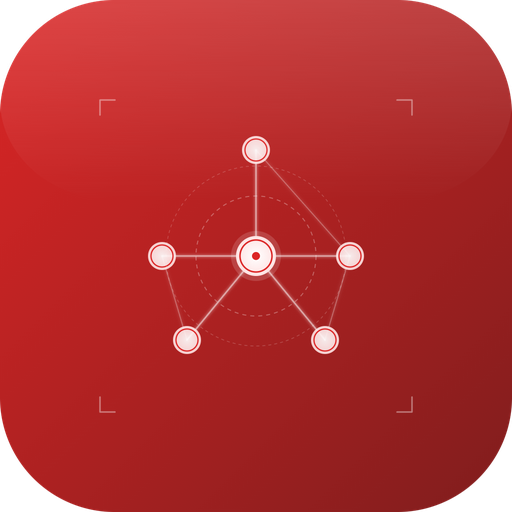
</p>

<h1 align="center">Red Grid Link</h1>

[](https://github.com/RedGridTactical/RedGridMGRS)
[]()
[](LICENSE)
[](PRIVACY.md)
[]()
[]()
[]()
[]()
[]()
[]()
[]()
[](https://buymeacoffee.com/redgridtac0)

> ## Red Grid Link is retired
>
> **Retired September 27, 2026. v1.7.0 is the final release.** Link has been removed from sale on the App Store and unpublished on Google Play. New subscriptions and lifetime purchases are no longer offered.
>
> - **Existing installations:** Retirement does not erase local maps, sessions or exports. Keep the installed app and back up important data using its export tools before changing devices or uninstalling. Future compatibility and reinstallation are not guaranteed.
> - **Final release access:** v1.7.0 gives previously free users Pro+Link access, including themes, maps, AAR export and full Field Link. It preserves stored paid entitlements. No new purchase is required for that access.
> - **Past purchases:** Check Apple or Google's subscription settings and purchase history for your account. For billing questions, contact support@redgridtactical.com.
> - **Maintained product:** Development continues in [Red Grid MGRS](https://github.com/RedGridTactical/RedGridMGRS), available on [iOS](https://apps.apple.com/app/id6759629554) and [Android](https://play.google.com/store/apps/details?id=com.redgrid.redgridtactical).
> - **Transport matters:** MGRS does **not** replace Link's phone-to-phone Bluetooth/Multipeer/Nearby transport. MGRS team radio features require compatible Meshtastic hardware. There is no automatic transfer of Link data or purchases to MGRS.
>
> This public source repository is retained for reference under [MIT + Commons Clause](LICENSE). The license restricts selling the software; it is not an unrestricted open-source license. No further Link releases are planned, and issues and pull requests are not actively maintained.

---

**Offline MGRS maps and nearby team coordination for small teams (2-8 people). No cell service needed for active Field Link sessions.**

Built on the MGRS engine from [Red Grid MGRS](https://github.com/RedGridTactical/RedGridMGRS). Field Link adds zero-config proximity sync over Bluetooth, with Apple Multipeer Connectivity (iOS) and Google Play Services Nearby Connections (Android) running alongside as a parallel higher-bandwidth transport -- your team appears on the map the moment they're in range.

> The feature descriptions below document the retired app. They are not an offer of current store availability or a roadmap commitment.

---

## Screenshots

| Team Map | MGRS Grid | Field Link | Tools | Themes |
|:---:|:---:|:---:|:---:|:---:|
| 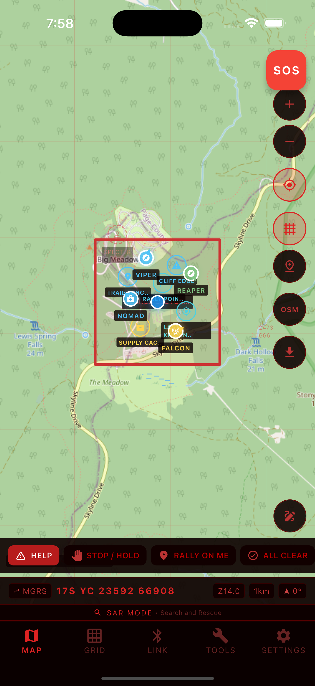 | 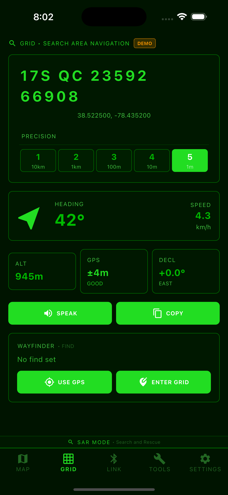 | 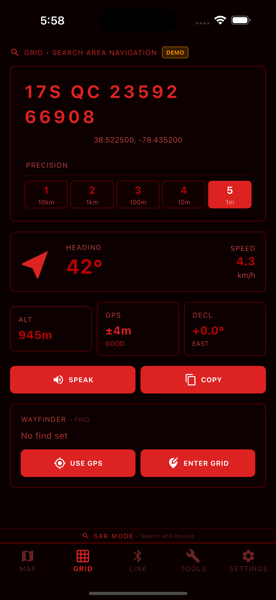 | 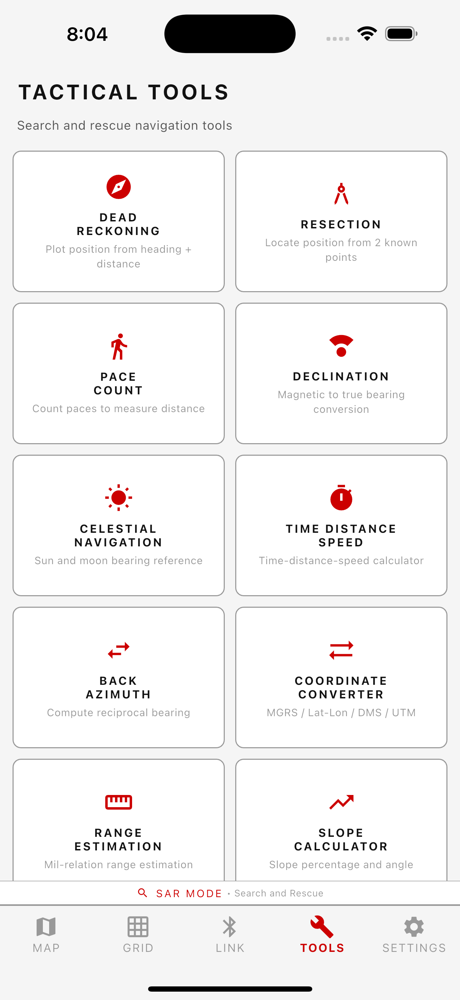 | 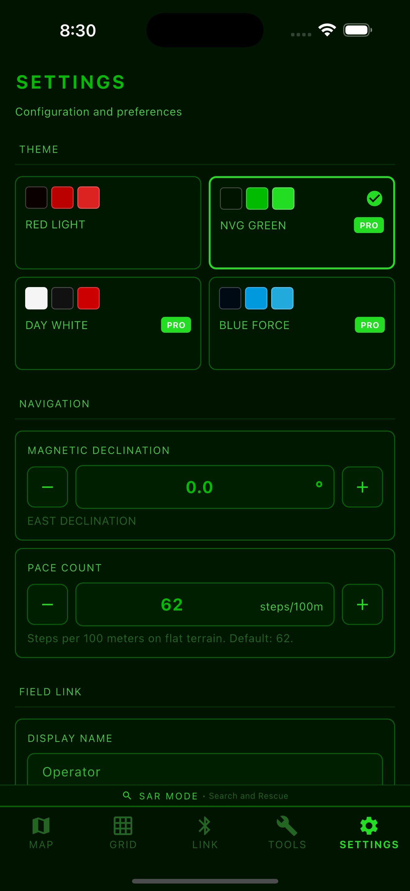 |

| Peer Detail | Dead Reckoning | Celestial Nav | Search Area | Team Roster |
|:---:|:---:|:---:|:---:|:---:|
| 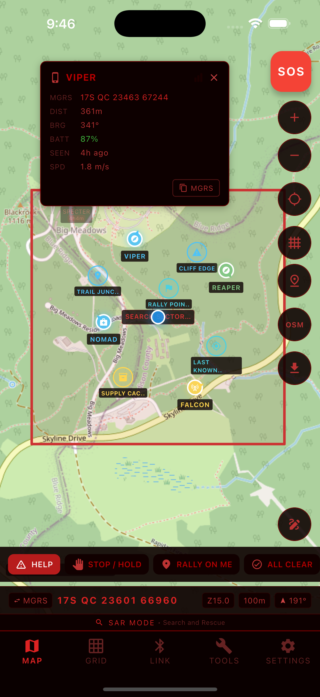 | 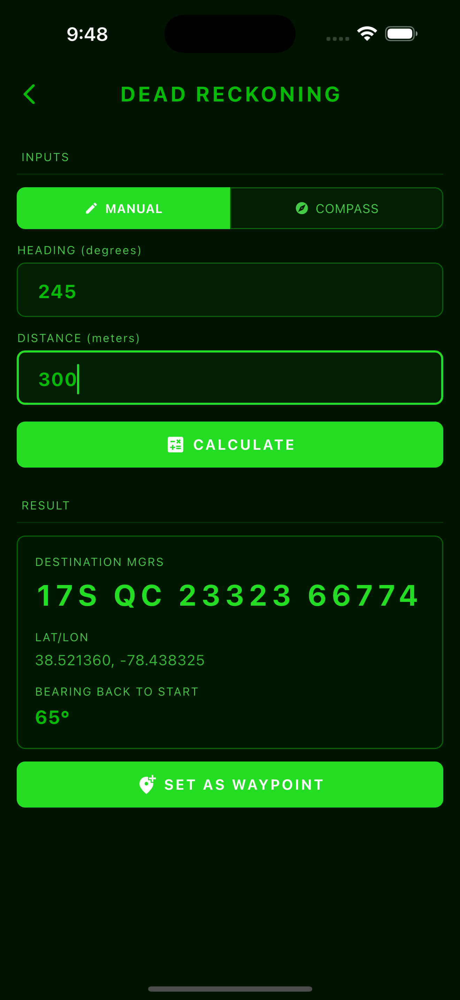 | 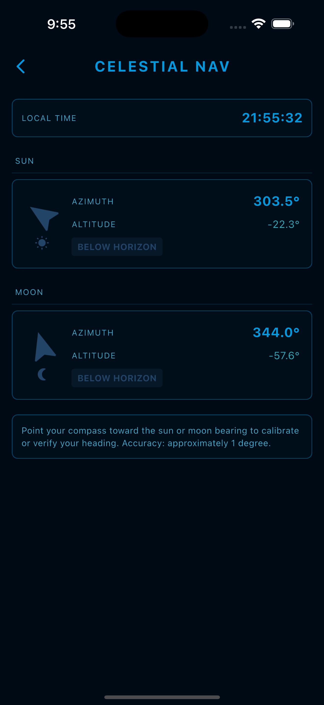 | 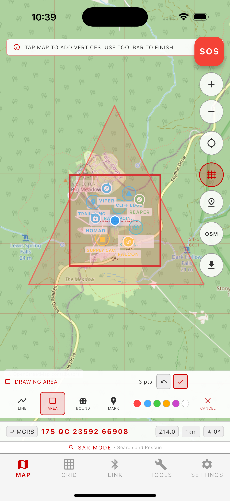 | 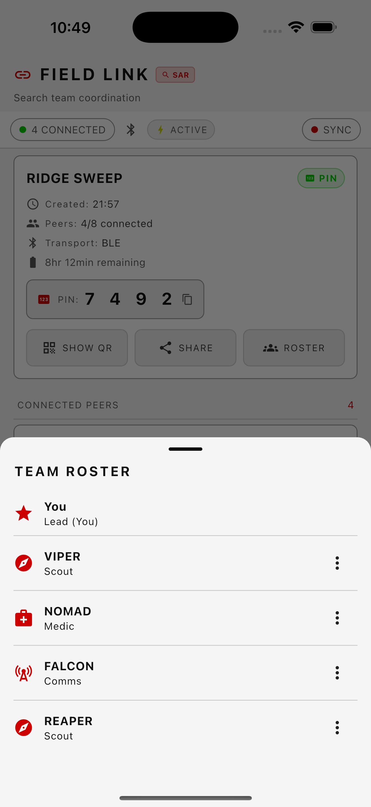 |

---

## Historical features

### MGRS-Native Navigation
Military Grid Reference System coordinates with 1-meter grid resolution. Actual accuracy depends on the location receiver and conditions; coordinate resolution is not an accuracy guarantee. GPS Kalman filtering smooths position estimates. MGRS grid overlay on offline maps from GZD down to 100m resolution. Bearing, distance, dead reckoning, resection, pace count (with accelerometer step detection), declination, and coordinate conversion tools. NATO phonetic voice readout for hands-free grid calls.

### Field Link -- Team Sync Without Infrastructure
Zero-config proximity sync over BLE on all platforms, with Apple Multipeer Connectivity (AWDL) on iOS and Google Play Services Nearby Connections on Android as parallel higher-bandwidth peer transports. Devices within range automatically discover each other and share position, marker, and annotation data. No cell service, pairing codes, or Red Grid servers required for active sessions.

- 2-8 devices per session
- AES-256-GCM encryption with ECDH P-256 ephemeral keys for PIN and QR sessions; Open sessions are unencrypted by design (training / demo use)
- Tiered session security: Open (auto-join, no encryption), PIN (4-digit, encrypted), QR code (host-generated session secret, encrypted)
- Delta payloads under 200 bytes per position update
- Ghost markers with time-decay visualization when teammates disconnect
- Velocity vectors project last-known movement direction
- Expedition Mode: BLE-only, 30-second updates
- Ultra Expedition Mode: BLE-only, 60-second updates
- Battery use varies by device, conditions and settings; no fixed hourly rate is guaranteed.
- Auto-reconnect with exponential backoff on disconnect

### Offline Maps
Download map packs from OpenStreetMap or OpenTopoMap to MBTiles for offline operation, with MGRS grid lines rendered as a dynamic overlay. Region downloads are throttled to respect public-tile-server usage policies; for sustained heavy offline usage we recommend a licensed provider. No additional provider integrations are planned for the retired app.

### 4 Operational Modes
One engine, four presentation layers. Terminology, icons, and quick actions adapt to your mission:
- **Search & Rescue** -- sector assignments, clue markers, search patterns
- **Backcountry** -- camp, waypoint, and trail navigation
- **Hunting** -- stand locations, game sightings, property boundaries
- **Training** -- exercise objectives, rally points, phase lines

### 11 Tactical Tools
Dead Reckoning, Resection, Pace Count, Bearing/Back Azimuth, Coordinate Converter (MGRS/Lat-Lon/DMS/UTM), Range Estimation, Slope Calculator, ETA/Speed Calculator, Magnetic Declination, Celestial Navigation, MGRS Precision Reference.

### Team Coordination (V1.3)
Assign roles (Lead, Scout, Medic, Comms, custom) with callsigns. Lead controls the session like a group admin. Share waypoints with the whole team or save them privately. Draw tap-to-place annotations visible to all peers. Set boundary geofences with automatic alerts when someone crosses. NATO phonetic voice callouts announce teammate positions hands-free. Export and import sessions as versioned JSON for backup and review.

### Range Awareness + Navigation (V1.4)
BLE Long Range / Coded PHY support is detected on capable hardware and shown with LR status when confirmed. Actual Bluetooth range depends on phones, terrain, vegetation, antenna orientation, and interference; longer-distance team awareness belongs on mesh/radio workflows such as Meshtastic. Live RSSI signal bars show connection quality for each teammate with warnings when signal weakens. FixPhrase encodes any location as 4 easy-to-remember words (~11m accuracy, order-independent). Choose between OpenStreetMap or OpenTopoMap when downloading offline regions. Coordinate bar cycles between MGRS and FixPhrase display.

### Security + Communication (V1.5)
Real ECDH P-256 key exchange with per-peer derived encryption keys. BLE Coded PHY negotiation on supported Android hardware. One-tap emergency beacon sends GPS coordinates to all team members with 30-second retransmission. 7 pre-canned tactical messages (HELP, STOP, RALLY ON ME, ALL CLEAR, FOUND SOMETHING, HEADING BACK, NEED SUPPLIES) plus 160-character free text over encrypted CRDT sync.

### After-Action Reports
One-tap PDF export: map snapshot, mission timeline, track data, timestamps, team roster with roles, per-member tracks, boundary events, markers, and session log. Share via AirDrop, file share, or any local transfer.

### 4 Tactical Themes
Red Light, NVG Green, Day White and Blue Force. Theme names do not imply night-vision equipment certification.

---

## How It Works

### Solo Mode
Open Red Grid Link and your MGRS position appears on the offline map. Navigate using bearing, distance, and dead reckoning tools -- identical to Red Grid MGRS but with a full map view and 11 tactical tools.

### Field Link (Team Mode)
1. **Start a session** -- tap one button to begin broadcasting over BLE
2. **Set security** -- choose Open, PIN, or QR code authentication
3. **Teammates appear** -- any nearby device running Red Grid Link is automatically discovered over Bluetooth. Actual range varies by hardware, terrain, and interference; use mesh/radio bridges for longer-distance team awareness
4. **Positions sync** -- delta updates flow between all devices at configurable intervals; PIN and QR sessions wrap each delta in an AES-256-GCM envelope, Open sessions send plaintext
5. **Ghosting** -- if a teammate moves out of range, their last-known position remains on your map with time-decay opacity (100% to outline over 30 minutes)
6. **Reconnect** -- when a ghost comes back in range, their marker snaps to live position

No accounts. No Red Grid servers. No cell service for active sessions. No configuration. It just works.

---

## Final release access and billing

The former Free, Pro, Pro+Link, Team and Lifetime offers are retired. The final v1.7.0 release elevates previously free users to Pro+Link locally and preserves existing paid entitlement values. Historical pricing is no longer an offer to buy or subscribe.

Existing installations retain their local data. Back up important sessions and exports before uninstalling or changing devices. Store removal does not transfer purchases, subscriptions or data to MGRS.

---

## Privacy

| Data | Collected | Stored | Transmitted |
|------|:---------:|:------:|:-----------:|
| GPS location | In use / background (sessions) | Local session DB | Field Link peers only (PIN / QR: AES-256-GCM; Open: plaintext) |
| Field Link positions | Active session | Local DB until you delete the session | AES-256-GCM in PIN/QR sessions, plaintext in Open sessions; always device-to-device |
| Map tiles | Downloaded | Local MBTiles | Standard HTTPS to tile servers (OSM / OpenTopoMap) |
| Waypoints & markers | User-created | Local DB | Field Link peers only (encrypted in PIN/QR sessions) |
| After-Action Reports | User-generated | Local/exported by user | Only when you export or share |
| Device identifiers | Never | Never | Never |

No accounts. No analytics. No ad networks. No cloud sync. Optional release-only crash diagnostics use Sentry with PII off and GPS coordinates stripped.
In-app purchases processed by Apple/Google -- Red Grid Link never sees your payment details.
Full details in [PRIVACY.md](PRIVACY.md).

---

## Build from Source

```bash
git clone https://github.com/RedGridTactical/RedGridLink.git
cd RedGridLink
flutter pub get
flutter pub run build_runner build --delete-conflicting-outputs
flutter run
```

Requires Flutter SDK and the platform native toolchains. This is the retired v1.7.0 source, including its local Pro+Link access for previously free users. New store purchases are unavailable. Field Link requires Bluetooth and location permissions on physical devices. Source builds are for reference and use permitted by the license; they do not carry a future support guarantee.

---

## Development status

Development ended with v1.7.0. [ROADMAP.md](ROADMAP.md) is a historical record: unfinished items and old target dates are cancelled plans, not promised releases. Ongoing product development is in [Red Grid MGRS](https://github.com/RedGridTactical/RedGridMGRS).

---

## Support and contributions

Link issues and pull requests are not actively maintained, and new feature requests are not being scheduled. For questions about an existing installation or past billing, contact support@redgridtactical.com. MGRS issues belong in the [MGRS repository](https://github.com/RedGridTactical/RedGridMGRS/issues).

---

## Red Grid Tactical projects

| Project | Status | Links |
|---------|--------|-------|
| **Red Grid MGRS** | Maintained iOS and Android navigation app; optional Meshtastic radios | [GitHub](https://github.com/RedGridTactical/RedGridMGRS) · [Website](https://redgridtactical.com/mgrs) |
| **Red Grid Link** | Retired; final v1.7.0 source retained for reference | [Retirement information](https://redgridtactical.com/link) |

Website: [redgridtactical.com](https://redgridtactical.com)

---

## License

[MIT + Commons Clause](LICENSE). See the license for the restrictions on selling the software. Retirement does not change the license.

Contact: support@redgridtactical.com

---

*Historical source for Red Grid Link. Maintained product: [Red Grid MGRS](https://github.com/RedGridTactical/RedGridMGRS).*
